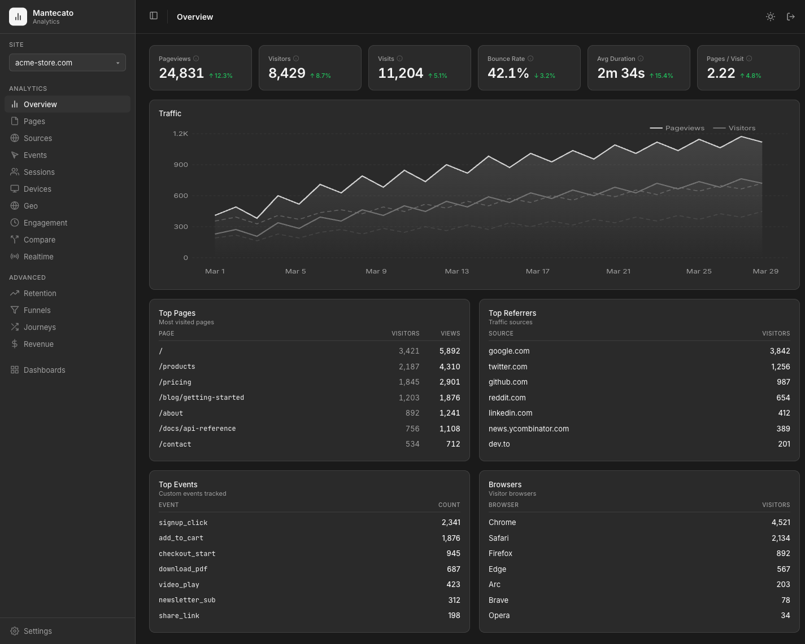

# 🧠 Mantecato

> ⚠️ **Pre-alpha** — expect breaking changes. Functional but not battle-tested.

**Talk to your analytics.** Mantecato connects to your existing [Umami](https://umami.is) database and lets you analyze traffic in natural language through an AI agent, explore the same data in a web dashboard, or query it from the CLI and MCP server.

It keeps your existing tracking setup and helps you work without writing SQL for routine analysis. It includes a full **web dashboard**, a **38-command CLI**, and a **41-tool MCP server** so you can move between visual exploration, automation, and AI workflows.



## Table of Contents

- [💬 Just Ask](#-just-ask)
- [🚀 Get Started](#-get-started)
- [🤖 Use with AI Agents](#-use-with-ai-agents)
- [📊 Web Dashboard](#-web-dashboard)
- [⌨️ CLI](#%EF%B8%8F-cli)
- [🐳 Container Deployment](#-container-deployment)
- [📚 Documentation](#-documentation)

---

## 💬 Just Ask

```
You:    "Analyze traffic for the last 30 days. Which pages are losing visitors?
         Where is the best traffic coming from?"

Agent:  "Traffic is up 12% (8,420 → 9,430 visitors). However, /blog/old-post
         dropped 45% and accounts for most of the bounce rate increase.
         Organic search drives 62% of quality traffic (3.2 pages/visit vs 1.4
         from social). Recommendation: redirect /blog/old-post, double down
         on SEO content."
```

Ask directly when you want a quick answer, then use the dashboard or CLI when you want to dig deeper.

---

## 🚀 Get Started

### What you need

- **Node.js 22+**
- A **PostgreSQL database** running [Umami](https://umami.is) (tested with Neon)
- Your Umami database connection string

### Install and run

```bash
git clone https://github.com/g-battaglia/mantecato-analytics.git
cd mantecato-analytics
npm install --legacy-peer-deps

cp .env.example .env   # add your DATABASE_URL and a random SESSION_SECRET

npx prisma db pull
npx prisma generate

npm run dev
```

Open `http://localhost:3000` and log in with your Umami credentials.

> 💡 **Tip:** You can paste the steps above into Claude Code, OpenCode, Cursor, or Cline and let the agent set everything up for you automatically.

### 🔑 Generate an API key

API keys are needed for the CLI and AI agent integrations:

1. Open the web dashboard
2. Go to **Settings > API Keys**
3. Click **New Key** and copy the generated key (`mtk_...`)
4. Add it to your `.env` file: `MANTECATO_API_KEY=mtk_...`

---

## 🤖 Use with AI Agents

Mantecato works with AI coding agents in two main ways:

| Method | How it works | Best for |
|--------|-------------|----------|
| **🖥️ CLI** | The agent runs terminal commands to query your data | OpenCode, Claude Code, OpenClaw, Cline — any agent with shell access |
| **🔌 MCP** | The agent calls structured tools via [Model Context Protocol](https://modelcontextprotocol.io/) | Claude Desktop, Cursor, OpenClaw, any MCP-compatible client |

### Ready-to-use agent configs

This repo includes pre-built configurations for popular AI tools. Open the project folder in your agent and start asking questions:

| Tool | What's included | How to start |
|------|----------------|-------------|
| **OpenCode** | `site-analyst` agent + 3 analysis skills | `cd mantecato-analytics && opencode`, select **site-analyst** from the agent picker |
| **Claude Code** | `CLAUDE.md` + 3 slash commands | `cd mantecato-analytics && claude`, use `/project:traffic-report`, `/project:content-audit`, `/project:funnel-analysis` |
| **OpenClaw** | 3 analysis skills (traffic-report, content-audit, funnel-analysis) | Install skills from the `.openclaw/` directory, then ask questions or invoke skills |
| **Cline** | `.clinerules` with full CLI reference | Open the project in VS Code with Cline installed |
| **Cursor** | `.cursorrules` with full CLI reference | Open the project in Cursor |

### Add the MCP server (optional)

For agents that support MCP, add this to your editor's MCP configuration:

```json
{
  "mcpServers": {
    "mantecato": {
      "command": "npx",
      "args": ["tsx", "src/mcp/server.ts"],
      "cwd": "/path/to/mantecato-analytics",
      "env": {
        "DATABASE_URL": "postgresql://...",
        "MANTECATO_API_KEY": "mtk_..."
      }
    }
  }
}
```

Where to put this config depends on your tool. See **[docs/ai-agents.md](docs/ai-agents.md)** for step-by-step instructions for each platform.

---

## 📊 Web Dashboard

The web dashboard gives you a visual view of the same analytics data:

| Page | What it shows |
|------|-------------|
| 📈 **Overview** | Pageviews, visitors, visits, bounce rate, avg duration with time series and annotations |
| 📄 **Pages** | Per-page views, time-on-page, entries/exits, bounce rate |
| 🔗 **Sources** | Referrers, UTM params, channels, click IDs |
| ⚡ **Events** | Custom event metrics with property breakdown |
| 👤 **Sessions** | Session list with full event-by-event replay |
| 💻 **Devices** | Browser, OS, device type, screen size, language |
| 🌍 **Geo** | Country/region/city with interactive world map |
| 🔴 **Realtime** | Live active visitors and event stream |
| ⚖️ **Compare** | Side-by-side period comparison |
| 🔄 **Retention** | Cohort retention matrix |
| 🔽 **Funnels** | Multi-step conversion with drop-off rates |
| 🗺️ **Journeys** | Sankey diagram of user paths |
| 💰 **Revenue** | Revenue summary, time series, breakdowns |
| ⏱️ **Engagement** | Session duration distribution and percentiles |
| 🎛️ **Dashboards** | Custom drag-and-drop widget dashboards with PDF/PNG export |
| ⚙️ **Settings** | Site management, API key generation |

---

## ⌨️ CLI

The same analytics data is available in your terminal:

```bash
# Overview stats
npm run cli -- stats --site mysite.com --period 30d

# Top pages as JSON
npm run cli -- pages --site mysite.com --limit 10 --format json

# Funnel analysis
npm run cli -- funnel --site mysite.com --steps "/,/pricing,/signup"

# Filter by country
npm run cli -- devices --site mysite.com --dimension browser --filter country:eq:US
```

38 commands covering analytics, CRUD, and data export. Full reference: **[docs/cli.md](docs/cli.md)**

---

## 🐳 Container Deployment

```bash
# Docker Compose
docker compose up -d

# Apple Containers (macOS Sequoia+)
container build -t mantecato:latest --memory 4096MB --cpus 4 .
container run -d --name mantecato -p 3000:3000 --env-file .env mantecato:latest
```

Full guide with production tips: **[docs/docker.md](docs/docker.md)**

---

## 📚 Documentation

| Doc | What it covers |
|-----|---------------|
| 🤖 **[AI Agent Setup](docs/ai-agents.md)** | Step-by-step setup for OpenCode, Claude Code, Claude Desktop, OpenClaw, Cline, Cursor |
| ⌨️ **[CLI Reference](docs/cli.md)** | All 38 commands, options, filters, examples |
| 🔌 **[MCP Server](docs/mcp-server.md)** | All 41 tools, parameters, examples |
| 🔑 **[Authentication](docs/authentication.md)** | API key generation, security, management |
| 🐳 **[Docker](docs/docker.md)** | Container deployment, Docker Compose, production tips |

---

## ⚠️ Important Notes

- **Read-only database** — Umami remains the source of truth. Mantecato only writes to the `report` table (for API keys, saved views, and related app data). Never run Prisma migrations.
- `npm install` requires `--legacy-peer-deps` because `react-simple-maps` is not yet aligned with React 19.

---

<details>
<summary>🛠️ <strong>Tech Stack</strong></summary>

| Layer | Technology |
|-------|-----------|
| Framework | Next.js 16 (Turbopack) + React 19 |
| Database | PostgreSQL via Prisma 7.5 |
| UI | shadcn/ui + Radix primitives |
| Charts | Recharts, react-simple-maps, d3-sankey |
| Data | TanStack Query + TanStack Table (virtualized) |
| State | Zustand |
| CLI | Commander.js v14 |
| MCP | @modelcontextprotocol/sdk v1.27 |
| Auth | JWT sessions (web), SHA-256 API keys (CLI/MCP) |

</details>

<details>
<summary>📁 <strong>Project Structure</strong></summary>

```
src/
  app/            # Next.js pages + API routes
  cli/            # CLI (38 commands)
  mcp/            # MCP server (41 tools)
  components/     # React components
  queries/        # SQL query modules
  lib/            # Core utilities (auth, date, format, export)
  hooks/          # React hooks
  stores/         # Zustand stores
docs/             # Documentation
.opencode/        # OpenCode agent + skills
.openclaw/        # OpenClaw skills
.claude/          # Claude Code slash commands
packages/tracker/ # Lightweight tracking script
```

</details>

## License

MIT
